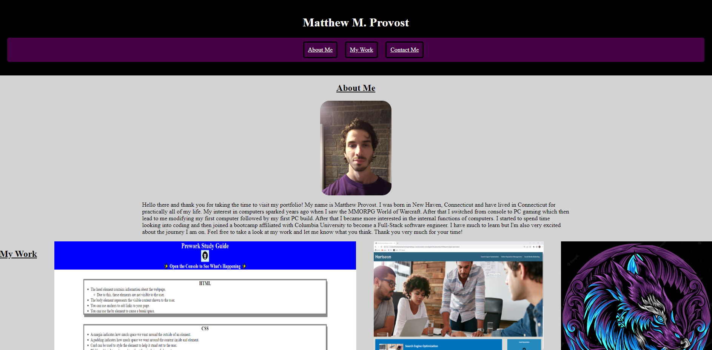
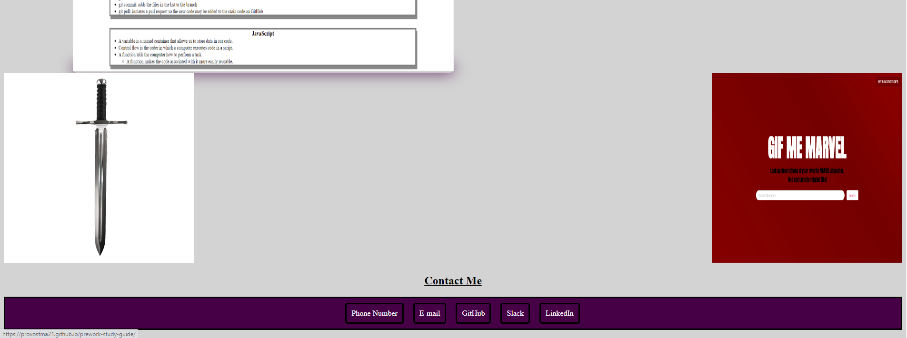

# <Challenge 2 Professional Portfolio>

## Description

This project is meant to give me a start on a professional portfolio that I can continue to build upon as time goes on both during the bootcamp as well as after if I so choose. This is not only good practice for putting what I learned on a page, but it also lets me showcase my abilities to potential employers. This portfolio, if done right, can help me stick out among many and may very well be the difference between a potential employer contacting me or not about an interview. I learned quite a bit about how much of a difference the sequence of lines of code can make to the overall make-up of a site as well as delving further into functions such as hover glows for my links.

## Usage

In order to use this site, you can use the navigation bar to pick which section you would like to visit: About Me, My Work, or Contact Me.
From there you can read a little about me and how I got into coding, view my past work, and even see a few different ways to get in touch with me.

## Link

https://provostma21.github.io/chal2_portfolio/